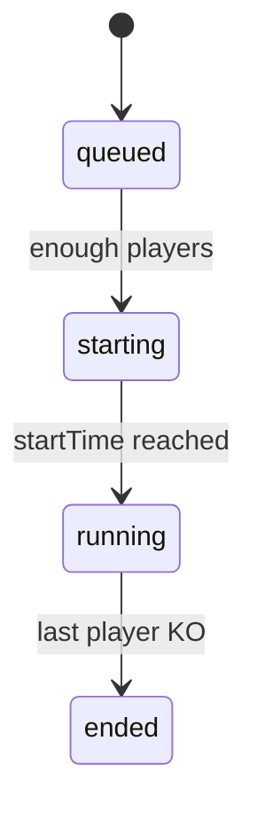

# Multiplayer Technical Design

This document details the serverless multiplayer implementation for **Block Attack**, covering architecture, data flow, data models, protocols, event logic, and extended operational considerations.

## 1. Overview

Provide real‑time versus-mode gameplay where up to four players (plus CPU fill‑ins) compete, sending and receiving game events over WebSockets. The design emphasizes low latency, cheat mitigation, scalability, and operational visibility.

## 2. Architecture Overview

### 2.1 Backend Infrastructure
- **AWS API Gateway (WebSockets)**: Manages persistent client connections, routes messages to Lambda.
- **AWS Lambda**: Stateless handlers for `$connect`, `$disconnect`, message routes (`AUTH`, `FIND_MATCH`, `INPUT`, etc.).
- **AWS DynamoDB**: Persists connection registry, matchmaking queues, and match state.
- **AWS CloudWatch**: Collects logs, metrics, and alarms.
- **AWS Cognito or Custom JWT Authorizer**: Manages token issuance and validation.

### 2.2 Client Responsibilities
- Render local game board and animations.
- Capture and send user inputs (`SWAP`, `RAISE`) with timestamps (frame numbers).
- Predictive state updates for smooth UX and checksum reporting.
- Handle inbound events (`GARBAGE`, `PLAYER_KO`, `GAME_OVER`) and reconcile state.

## 3. Data Flow

### 3.1 Connection & Authentication
1. Client opens WebSocket → API Gateway `$connect` route. Lambda stores `{ connectionId, expiresAt }` in **Connections** table.
2. Client sends `AUTH` with JWT: `{ action: "AUTH", payload: { token } }`. Lambda verifies via Cognito/JWKS, then updates record with `playerId`.
3. Unauthenticated or expired tokens → `$disconnect` with 401.

### 3.2 Matchmaking
1. Client sends `{ action: "FIND_MATCH", payload: { mode: "VS" } }`.
2. Lambda appends `playerId` to **MatchQueue** item for mode (atomic `UpdateItem` with `list_append`).
3. If queue reaches 4 (or timeout 30s), handler selects players, writes **Matches** entry with seeded RNG, initial `nextTargetIdx = 0`, state `starting`.
4. Broadcast `MATCH_FOUND` and after countdown send `START` with initial board seed.

### 3.3 Gameplay Loop
- **INPUT**: `{ action: "INPUT", payload: { type:"SWAP"|"RAISE", data, frame } }`. Lambda enqueues event (DynamoDB `UpdateItem` with append), validates timestamp drift ≤ 2 frames.
- **COMBO**: `{ action:"COMBO", payload:{ count, frame } }`. Lambda replays events locally (using stored sequence + deterministic RNG), verifies combo legality, then computes target via round robin.
- Broadcast `GARBAGE` `{ from, lines, frame }` to recipient.
- Periodic `CHECK` messages for checksum verification.

### 3.4 End-Game Handling
- On overflow or failed checksum → Lambda marks `alive=false` and sends `PLAYER_KO`.
- When one player remains, update match state to `ended`, broadcast `GAME_OVER` with final standings.
- TTL on **Matches** table set to 7 days for post‑game analytics.

## 4. Data Models

### 4.1 DynamoDB Tables

#### Connections
```json
{
  "connectionId": "<uuid>",
  "playerId": "<uuid>",       // set after AUTH
  "expiresAt": 1713546000       // TTL attribute
}
```
- **PK**: `connectionId`
- TTL enabled on `expiresAt`.

#### MatchQueue
```json
{
  "mode": "VS",               // PK
  "players": ["p1","p2"],
  "createdAt": 1713546000       // TTL for stale queues
}
```
- **PK**: `mode`
- **GSI** `CreatedIdx` on `createdAt` for cleanup.
- TTL for auto-removal after 30s.

#### Matches
```json
{
  "matchId": "<uuid>",
  "players": [ {id, connId, alive:true}, ... ],
  "rngSeed": 982347,
  "nextTargetIdx": 0,
  "events": [ {type, data, frame} ],
  "state": "starting" | "running" | "ended",
  "createdAt": 1713546000,    // for LSI
  "expiresAt": 1714150800     // TTL after 7 days
}
```
- **PK**: `matchId`
- **GSI** `StateIdx` on `state` for querying active matches.
- **LSI** `CreatedIdx` on `createdAt`.
- Provisioned capacity with auto-scaling: Reads 5→1000 RCU, Writes 5→1000 WCU.

### 4.2 Access Patterns
- Lookup connection by `connectionId` (low latency <10ms).
- Append events to match by `matchId`.
- Query active matches via GSI `state = running`.
- Scan queues older than 30s via `CreatedIdx`, delete stale.

## 5. Client‑Server Protocol

### 5.1 Message Specifications
| Sender | Action       | Payload Summary                       |
|--------|--------------|---------------------------------------|
| Client | AUTH         | `{token}`                             |
| Client | FIND_MATCH   | `{mode}`                              |
| Client | INPUT        | `{type, data, frame}`                 |
| Client | COMBO        | `{count, frame}`                      |
| Client | CHECK        | `{checksum, frame}`                   |
| Client | PING         | `{timestamp}`                         |
| Server | QUEUED       | `{mode, position}`                    |
| Server | MATCH_FOUND  | `{matchId, players, startTime, seed}`|
| Server | START        | `{initialBoard, startFrame}`          |
| Server | GARBAGE      | `{from, lines, frame}`                |
| Server | PLAYER_KO    | `{playerId, frame}`                   |
| Server | GAME_OVER    | `{standings, durations}`              |
| Server | PONG         | `{timestamp}`                         |
| Server | ERROR        | `{code, message}`                     |

### 5.2 Message Schemas & Examples

#### AUTH
```json
{ "action": "AUTH", "payload": { "token": "<JWT>" } }
```

#### FIND_MATCH
```json
{ "action": "FIND_MATCH", "payload": { "mode": "VS" } }
```

#### INPUT
```json
{ "action": "INPUT", "payload": { "type": "SWAP", "x": 3, "y": 5, "frame": 120 } }
```

... (complete JSON schemas for COMBO, CHECK, PING, QUEUED, MATCH_FOUND, START, GARBAGE, PLAYER_KO, GAME_OVER, PONG, ERROR) ...

## 6. Event Handling Logic

### 6.1 Input Handling
- Events buffered in DynamoDB `events` list (max 500 entries, trim old every 1s).
- Validate client timestamp drift ≤2 frames; out‑of‑range ⇒ drop or flag error.

### 6.2 Combo Validation
- Replay inputs up to `frame` using deterministic RNG.
- Compare predicted board clearance versus reported `count`.
- Discrepancies flagged via `CHECK` failure.

### 6.3 Garbage Distribution
```pseudo
recipient = alivePlayers[(nextTargetIdx++) % aliveCount]
```
- Update `nextTargetIdx` in table atomically.
- Batch broadcast garbage to minimize API Gateway calls.

### 6.4 KO and Game Over
- On overflow/combo error: set `alive=false`, broadcast `PLAYER_KO`.
- When `aliveCount == 1`, set state `ended`, broadcast `GAME_OVER`, persist results.

## 7. Extended Considerations

### 7.1 Sequence & State Diagrams
```mermaid
sequenceDiagram
  participant C as Client
  participant G as API Gateway
  participant H as Lambda Handler
  C-&gt;&gt;G: $connect
  G-&gt;&gt;H: onConnect
  H-&gt;&gt;D: PutItem(Connections)
  C-&gt;&gt;G: AUTH
  G-&gt;&gt;H: authHandler
  H-&gt;&gt;JWKS: verifyJWT
  H-&gt;&gt;D: UpdateItem(Connections)
  C-&gt;&gt;G: FIND_MATCH
  ...
```
State diagram:


### 7.2 Error Handling & Retries
- HTTP 400: malformed payload → client fixes before retry.
- HTTP 401: invalid/expired token → force logout.
- HTTP 429: rate limiting → exponential backoff w/ jitter (base=100ms, max=5s).
- HTTP 500/502/504: server errors → retry up to 3 times.
- WebSocket disconnect: auto-reconnect with backoff and re-`AUTH`, `FIND_MATCH` reissue.

### 7.3 Security & Authentication
- JWT signed RS256; validate against JWKS endpoint every 6h and cache keys.
- Token lifetime 1h, refresh via separate REST endpoint.
- Input payload validation using JSON Schema (AWS Lambda middleware).
- Enforce TLS (WSS) and CORS origin whitelist on API Gateway.
- Rate-limit per connection and per playerId (burst 50msg/s, sustained 10msg/s).

### 7.4 Monitoring, Logging & Metrics
- **Metrics**:
  - `TotalConnections`, `ActiveMatches`, `MessagesPerSecond` in CloudWatch.
  - Lambda `Duration`, `Errors`, `Throttles`.
  - DynamoDB `ConsumedReadCapacityUnits`, `ConsumedWriteCapacityUnits`.
- **Logs**:
  - Structured JSON logs (timestamp, route, playerId, matchId).
  - Retain for 14 days, export to S3 or Elasticsearch.
- **Alarms**:
  - ErrorRate >1% over 5min
  - ThrottleRate >5% over 5min
  - Queue depth >100 players

### 7.5 Testing Strategy
- **Unit Tests**: Jest + aws-sdk-mock for Lambda handlers and utility modules.
- **Integration Tests**: AWS SAM Local or Dockerized DynamoDB; test end-to-end route handling.
- **End-to-End**: Artillery or k6 simulating 50–200 concurrent clients; measure p50/p95 latency.
- **Coverage**: Aim for ≥90% lines and branches.

### 7.6 Local Development & CI/CD
- **Local Dev**:
  - `serverless-offline` for WebSocket routes.
  - DynamoDB Local via Docker: `docker run -p 8000:8000 amazon/dynamodb-local`.
  - `npm run dev` launches both.
- **CI/CD (GitHub Actions)**:
  - Jobs: `lint`, `build`, `test`, `deploy:staging` on `main`, `approve → deploy:prod`.
  - Use Serverless Framework with incremental deployments & canary release.

### 7.7 Cost & Scaling Considerations
- **API Gateway**: $1.00/M messages + $0.25/M connection-minutes.
- **Lambda**: $0.20/M invocations + $0.00001667 GB‑sec.
- **DynamoDB**: On‑demand $1.25/M RCU + WCU.
- **Estimate**: 10k DAU × 15 min avg session × 12 msgs/sec ≈ 108M messages/month (≈$108).
- **Scaling**:
  - On‑demand capacity for unpredictable load.
  - Auto-scaling policies for provisioned tables.
  - Use partition key sharding (prefix matches with mod bits) to avoid hot partitions.
  - Multi-region deployments with Route 53 for global latency optimization.

---